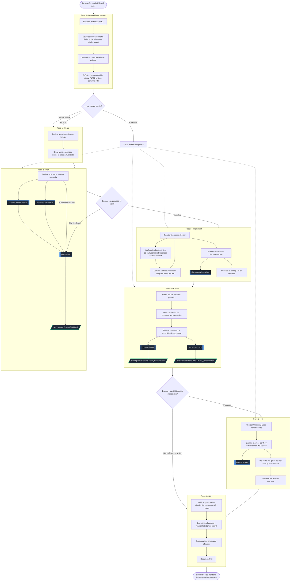

# Flujo de resolución de issues (`/issue-workflow`)

Este documento describe, para lectura humana, cómo funciona el skill [`issue-workflow`](../.claude/skills/issue-workflow/SKILL.md): sus seis fases, en qué puntos se detiene a preguntar, qué artefactos deja y qué subagentes despierta en cada tramo.

La **especificación normativa** del flujo es el `SKILL.md` — es lo que el agente ejecuta. Este documento es su mapa: si alguno de los dos se desactualiza, manda el `SKILL.md`.

## Mapa del flujo

Los rombos son pausas con `AskUserQuestion`: el flujo no avanza sin respuesta del usuario. Los nodos con doble borde son subagentes; los que tienen forma de paralelogramo, los artefactos que quedan escritos en `workspace/<number>/`.

La Fase 3 cierra abriendo un **PR en borrador**, así que la integración continua corre mientras la Fase 4 revisa, en vez de después. Eso reparte los gates en dos tiers: la sesión corre localmente los baratos (`typecheck`, `lint`, `stylelint`, `test`, `check-agents`) y delega al borrador los lentos (`build`, `storybook`, `studio-build`, `e2e`). El borrador no convoca a nadie —no solicita reviewers ni notifica codeowners— y bloquea el merge; el evento que pide la review humana es `gh pr ready`, en la Fase 6.

## Los tres puntos de pausa

El flujo se detiene exactamente en tres lugares, siempre vía `AskUserQuestion`:

1. **Fase 0 — reanudación.** Solo si detecta trabajo previo sobre el issue (rama, plan, review o commits). Una sesión nueva no pausa acá.
2. **Fase 2 — aprobación del plan.** No se implementa nada sin un "Aprobar" explícito. El feedback se reenvía a la misma tarea del `plan-writer`, que reescribe el plan en el mismo archivo.
3. **Fase 4 — disposición de los hallazgos.** Si quedan hallazgos Críticos sin disposición, la opción de shipear directo no se ofrece.

Además hay pausas puntuales para acciones hacia afuera: crear un issue diferido (Fase 5) o los follow-ups fuera de alcance (Fase 6) requieren confirmación previa.

## Subagentes: qué despierta a cada uno

| Subagente              | Fase | Se despierta cuando…                                                                                            | Devuelve             |
| ---------------------- | ---- | --------------------------------------------------------------------------------------------------------------- | -------------------- |
| `domain-model-advisor` | 2    | el issue crea o modifica entidades de dominio, value objects, mappers del ACL, queries GROQ o tipos compartidos | texto al orquestador |
| `architecture-advisor` | 2    | el cambio es estructuralmente significativo — módulo, capa, bounded context o dirección de dependencias         | texto al orquestador |
| `plan-writer`          | 2    | siempre — recibe el aporte de los advisors que hayan corrido                                                    | `PLAN.md`            |
| `documentation-writer` | 3    | el cambio toca tipos, schemas de Sanity/Zod, contratos de API o terminología de dominio                         | archivos de doc      |
| `code-reviewer`        | 4    | siempre — recibe el resultado observado de los gates, locales y del borrador, para no re-correrlos              | `CODE_REVIEW.md`     |
| `security-auditor`     | 4    | el diff toca superficie de seguridad — ver la sección "Cuándo correr" de su propio agente                       | `SECURITY_REVIEW.md` |
| `test-generator`       | 5    | opcional, ante un hallazgo que sea un gap de cobertura                                                          | specs                |

Los dos advisors de la Fase 2 corren **antes** de planificar y en paralelo entre sí: su evaluación entra en el prompt del `plan-writer`, que no puede delegar por su cuenta. En la Fase 4, `code-reviewer` y `security-auditor` también corren en paralelo y escriben archivos distintos.

## Entornos: worktree o raíz

El flujo puede correr en un worktree propio bajo `.claude/worktrees/<number>` o en el working tree principal. La Fase 0 lo resuelve —por declaración explícita, por detección de un worktree previo, o preguntando— y esa decisión rige para toda la sesión, incluidos los subagentes delegados.

El worktree aísla la sesión de cualquier otra corriendo en paralelo, a cambio de un setup propio (`pnpm install` + `pnpm run config`). Se mantiene hasta que el PR mergee, para permitir reanudar; la limpieza se ofrece al reanudar un issue cuyo PR ya está mergeado.
